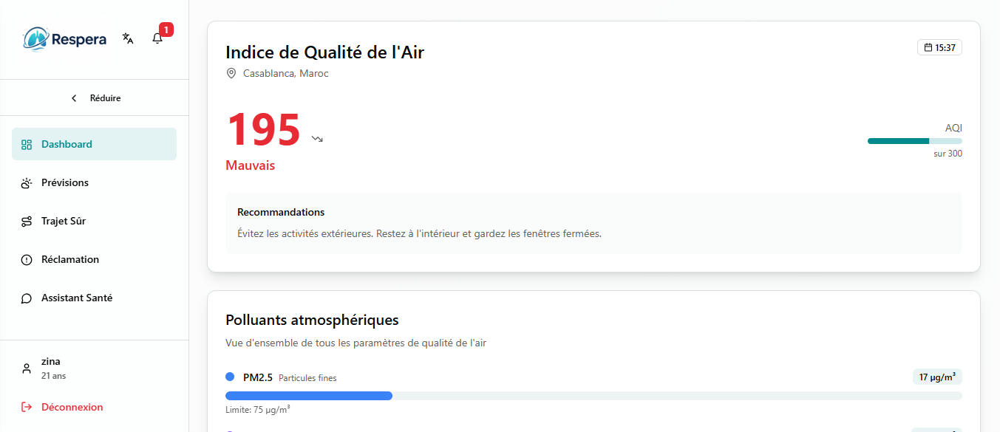
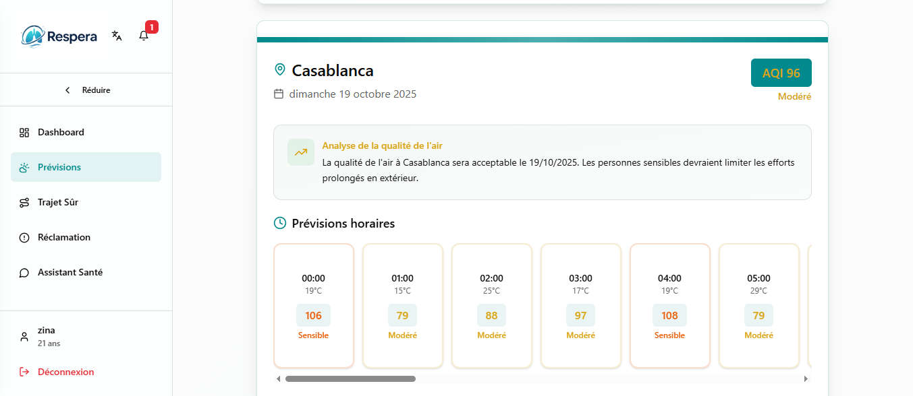
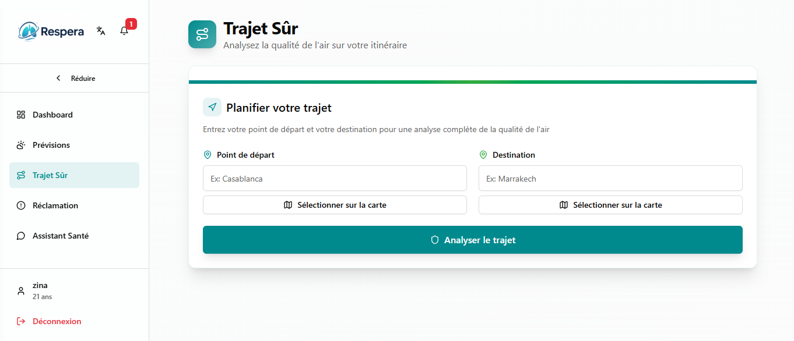
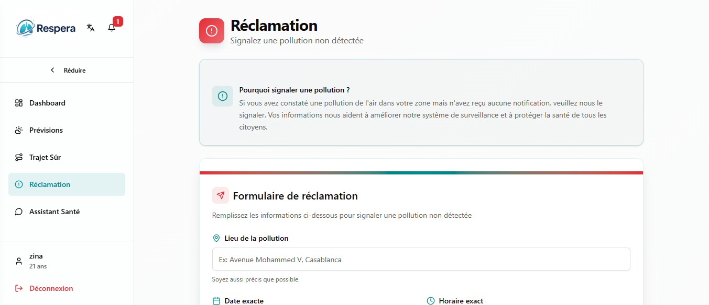
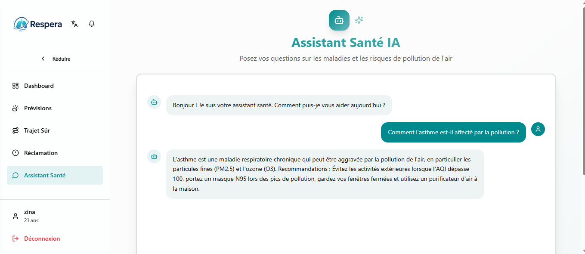

# 🌬️ Respera - Air Quality Monitoring

<p align="center">
  
  
</p>

## 🌍 About

**Respera** is a **web application** developed during the **48-hour Global Hackathon — 2025 NASA Space Apps Challenge (Agadir)** to monitor **air quality in Morocco**.  
It provides **real-time data**, **personalized forecasts**, and **health-based recommendations** tailored to users.

> Some parts of the code were generated using **V0 AI** to accelerate development.
 
 <br/>

## ✨ Key Features

- **Real-time Dashboard**: visualize the AQI index and main pollutants.  
- **Air Quality Forecasts**: hourly predictions for various cities.  
- **Safe Routes**: alternative route suggestions based on air quality.  
- **AI Chatbot**: advice on respiratory and cardiovascular health.  
- **Reports**: submit untracked pollution incidents.  
- **User Profile**: manage personal data and receive custom alerts.

  <br/>

## 📸 Application Preview

### Dashboard

<p align="center">
  
</p>

### Forecasts

<p align="center">
  
</p>

### Routes

<p align="center">
  
</p>

### Reports

<p align="center">
  
</p>

### Chatbot

<p align="center">
  
</p>
<br/>

## 🛠️ Technologies Used

- **Frontend** : Next.js, React, TypeScript, Tailwind CSS, Recharts
- **Outils & Librairies** : React Hook Form, Zod, Date-fns, Sonner, Next Themes

  <br/>

## 🚀 Installation & Setup

### 1. Clone the repository

```bash
git clone https://github.com/zinaakhtat/projetnasa.git
cd projetnasa
npm install
npm run dev
```

<br/>

## 🤝 Contributing

1. **Fork** the repository

2. **Create a new branch** for your feature

```bash
git checkout -b feature/AmazingFeature
```

3. **Commit** your changes

```bash
git commit -m "Add AmazingFeature"
```

4. **Push** to the branch

```bash
git commit -m "Add AmazingFeature"
```

5. **Open** a Pull Request

<br/>

## 📄 Licence

This project is licensed under the MIT License.
See the LICENSE file for more details.

<br/>

## 🙏 Remerciements

Special thanks to **Saâdia Boussiar**, **Hasna Amarmach**, **Nohaila El Idrissi**, and **Hajar Essaidi** for their collaboration during the hackathon.
And to V0 AI for assisting with rapid project development.
