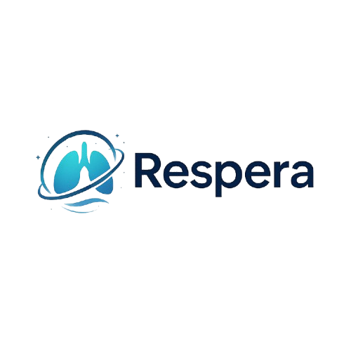
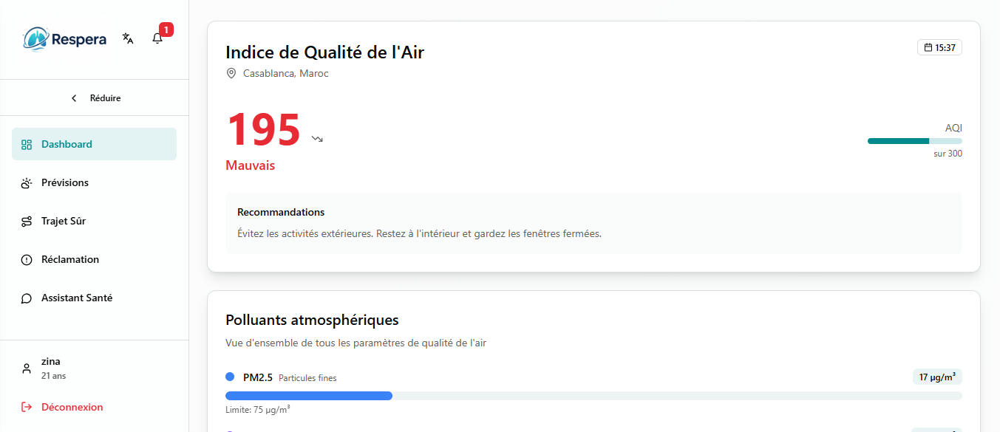
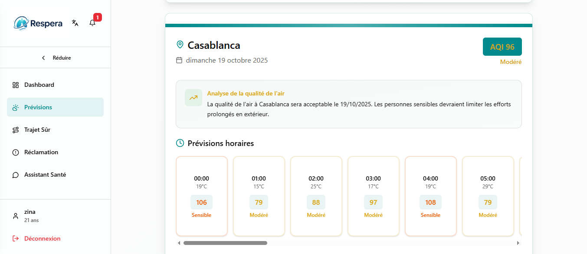
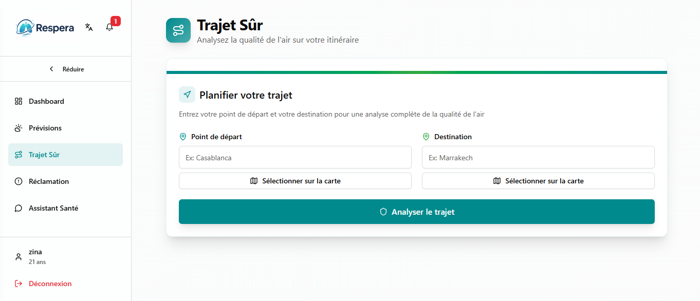
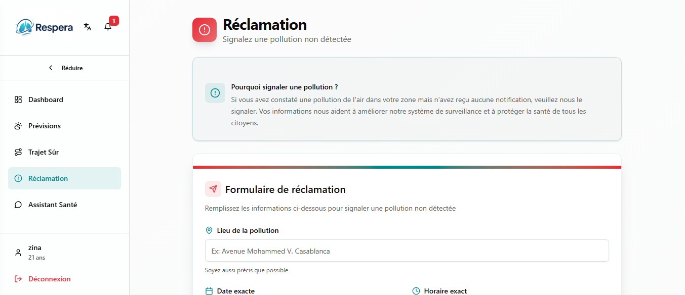
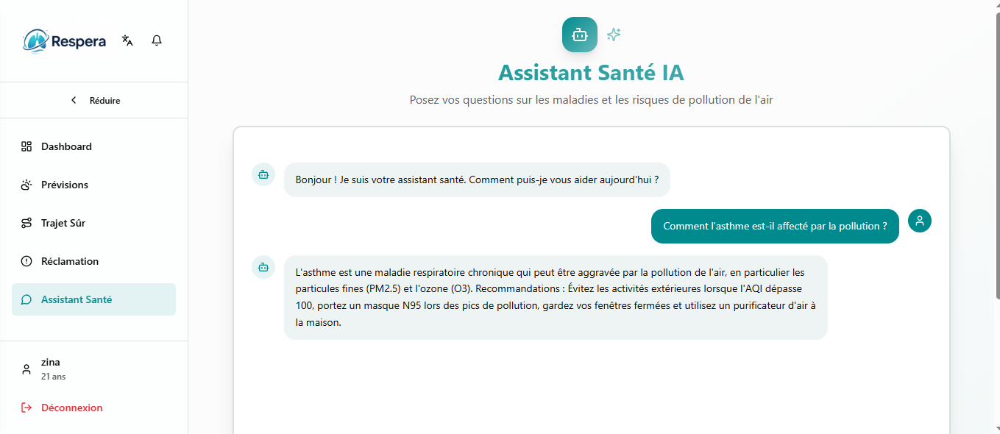

# 🌬️ Respera - Surveillance de la Qualité de l'Air

<p align="center">
  
  
</p>

## 🌍 À propos

Respera est une **application web ** développée lors du **48-hour global hackathon — 2025 NASA Space Apps Challenge (Agadir)** pour surveiller la **qualité de l’air au Maroc**.  
Elle fournit des **données en temps réel**, des **prévisions personnalisées** et des **conseils adaptés à la santé des utilisateurs**.

> Certaines parties du code ont été générées avec l’aide de **V0 AI** afin d’accélérer le développement.
> <br/>

## ✨ Fonctionnalités principales

- **Dashboard en temps réel** : visualisation de l’indice AQI et des principaux polluants.
- **Prévisions de qualité de l’air** : prévisions horaires pour différentes villes.
- **Trajets sûrs** : recommandations de trajets alternatifs selon la qualité de l’air.
- **Chatbot IA** : conseils sur les maladies respiratoires et cardiovasculaires.
- **Réclamations** : signalement de pollution non détectée.
- **Profil utilisateur** : gestion des informations personnelles et alertes personnalisées.

  <br/>

## 📸 Aperçu de l'application

### Dashboard

<p align="center">
  
</p>

### Previsions

<p align="center">
  
</p>

### Trajet

<p align="center">
  
</p>

### Reclamation

<p align="center">
  
</p>

### Chatbot

<p align="center">
  
</p>
<br/>

## 🛠️ Technologies utilisées

- **Frontend** : Next.js, React, TypeScript, Tailwind CSS, Recharts
- **Outils & Librairies** : React Hook Form, Zod, Date-fns, Sonner, Next Themes

  <br/>

## 🚀 Installation & démarrage

### 1. Cloner le repository

```bash
git clone https://github.com/zinaakhtat/projetnasa.git
cd projetnasa
npm install
npm run dev
```

<br/>

## 🤝 Contribution

1. **Fork** le repository

2. **Créer une branche** pour votre fonctionnalité

```bash
git checkout -b feature/AmazingFeature
```

3. **Committer** vos changements

```bash
git commit -m "Add AmazingFeature"
```

4. **Pousser** vers la branche

```bash
git commit -m "Add AmazingFeature"
```

5. **Ouvrir** une Pull Request

<br/>

## 📄 Licence

Projet sous licence **MIT**.  
Voir le fichier [LICENSE](Licence) pour plus de détails.

<br/>

## 🙏 Remerciements

Merci à **Saâdia Boussiar**, **Hasna Amarmach**, **nohaila el idrissi** et **Hajar Essaidi** pour leur collaboration lors du hackathon.
à **V0 AI** pour l’assistance dans le développement rapide du projet.
